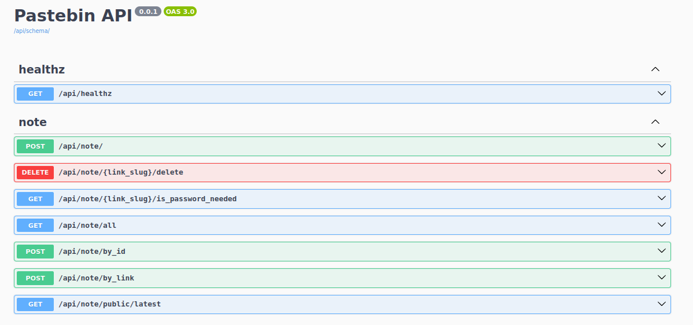
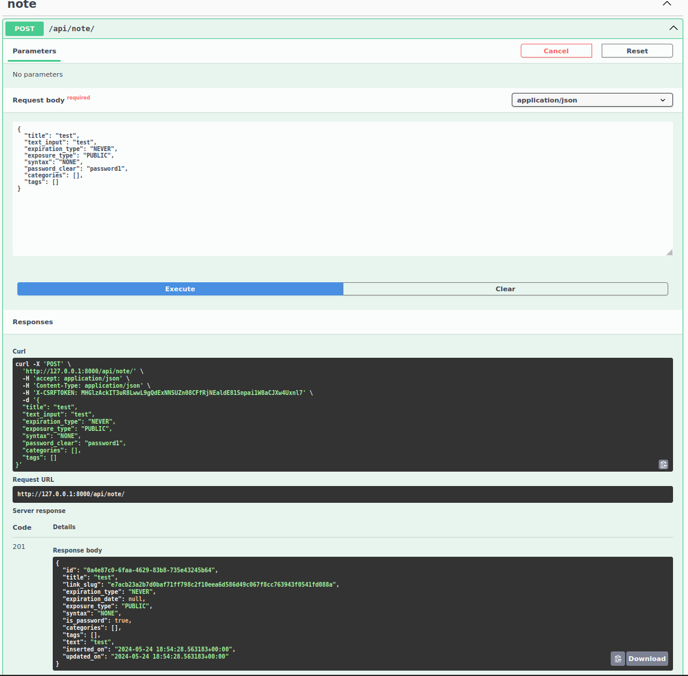
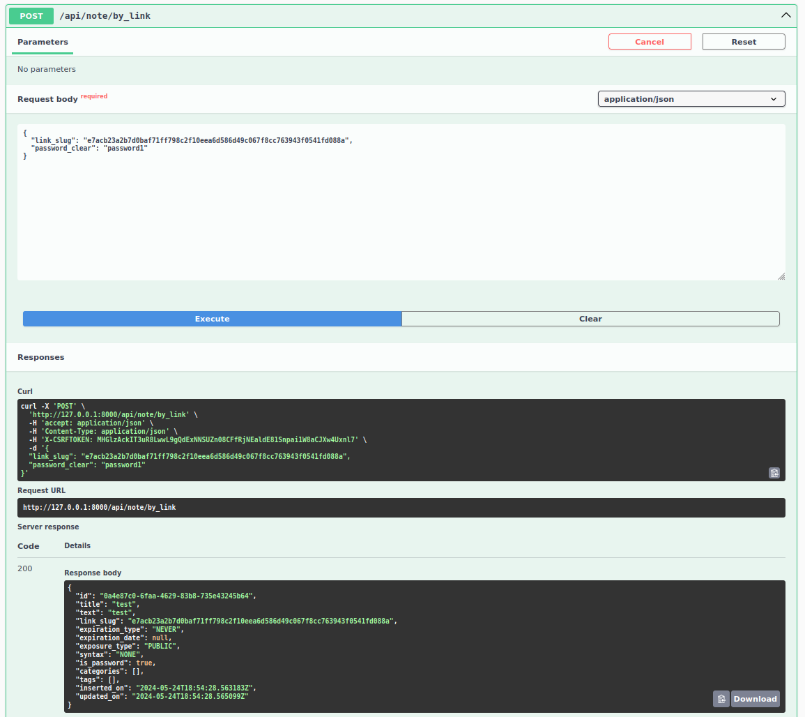
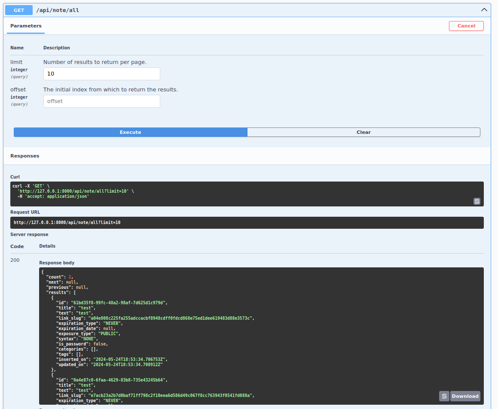

## Pastebin DRF
Pastebin clone with Django Rest Framework. An API for sharing your notes, you can add expiration time, password, syntax, categories or tags. Your note can be private or public

<!-- TOC -->
  * [Pastebin DRF](#pastebin-drf)
    * [Screenshots](#screenshots)
    * [TODO](#todo)
  * [Requirements](#requirements)
  * [First start](#first-start)
  * [Run](#run)
<!-- TOC -->

### Screenshots
<details>
<summary>Click to see</summary>

All endpoints


Create note


See note


See all shots with pagination

</details>

### TODO
- more tests
- show parameters possible values in swagger-ui (f.e. possible note categories)
- API token authentication

## Requirements
- Python >= 3.12
- Docker >= 24.0.5

## First start
Run commands
```shell
make up
make db-migrate
```

## Run
1. Run containers
   ```shell
   make up
   ```

2. In new terminal, run http-server
    ```shell
    make run-http-server
    ```

4. Go to http://127.0.0.1:8000/api/swagger-ui